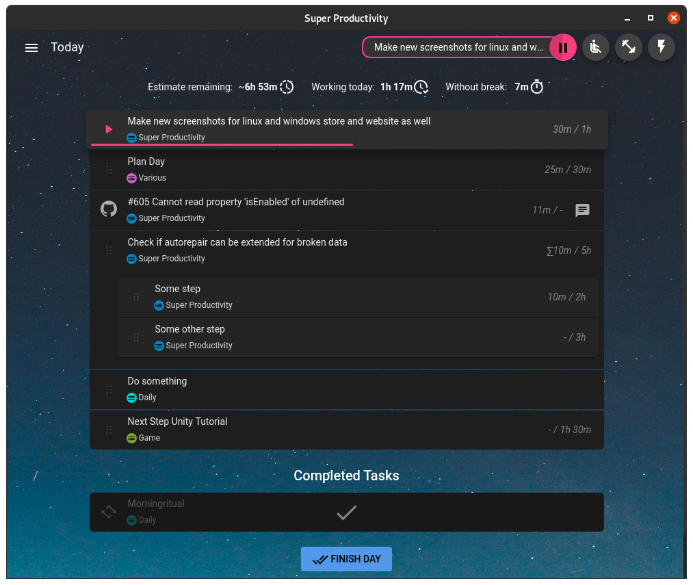

  <strong>
    An advanced todo list app with timeboxing & time tracking capabilities that supports importing tasks from your calendar, Jira, GitHub and others
  </strong>

  :globe_with_meridians: <a href="https://app.super-productivity.com">Open Web App</a> or :computer: <a href="https://github.com/super-productivity/super-productivity/wiki/2.01-Downloads-and-Install">Download</a>

 

<!-- The <a> and  elements are intentionally made without space.
     Because of the extra whitespace characters in <a>, makes blue underline lines appear for them.
     Please do not change this formatting, so as not to make them.
-->

  
  &nbsp;
  

  
  &nbsp;
  
  &nbsp;
  

  

## :computer: Downloads & Install

  
  
  
  
  
  
  

  <strong>For all current downloads, package links, and platform-specific notes:
  <a href="https://github.com/super-productivity/super-productivity/wiki/2.01-Downloads-and-Install" target="_blank">
    check the wiki</strong>. 
    
  </a>

  <a href="https://bank.gov.ua/en/news/all/natsionalniy-bank-vidkriv-rahunok-dlya-gumanitarnoyi-dopomogi-ukrayintsyam-postrajdalim-vid-rosiyskoyi-agresiyi" target="_blank">
     
    <strong>Humanitarian Aid for Ukraine</strong> 
    Support humanitarian relief via the official National Bank of Ukraine account.
  </a>

## :heavy_check_mark: Features

- **Keep organized and focused!** Plan and categorize your tasks using sub-tasks, projects and tags and color code them as needed.
- Use **timeboxing** and **track your time**. Create time sheets and work summaries in a breeze to easily export them to your company's time tracking system.
- Helps you to **establish healthy & productive habits**:
  - A **break reminder** reminds you when it's time to step away.
  - The **anti-procrastination feature** helps you gain perspective when you really need to.
  - Need some extra focus? A **Pomodoro timer** is also always at hand.
  - **Collect personal metrics** to see, which of your work routines need adjustments.
- Integrate with **Jira**, **Trello**, **GitHub**, **GitLab**, **Gitea**, **OpenProject**, **Linear**, **ClickUp** and **Azure DevOps**. Auto import tasks assigned to you, plan the details locally, automatically create work logs, and get notified immediately, when something changes.
- Basic **CalDAV** integration.
- Back up and synchronize your data across multiple devices with **Dropbox** and **WebDAV** support
- Attach context information to tasks and projects. Create **notes**, attach **files** or create **project-level bookmarks** for links, files, and even commands.
- Super Productivity **respects your privacy** and **does NOT collect any data** and there are no user accounts or registration. **You decide where you store your data!**
- It's **free** and **open source** and always will be.

And much more!

## :book: Documentation

Full guides and reference material live in the **[wiki](https://github.com/super-productivity/super-productivity/wiki)**. Quick links: [First steps](https://github.com/super-productivity/super-productivity/wiki/1.01-First-Steps), [Reference index](https://github.com/super-productivity/super-productivity/wiki/3.00-Reference), [How-To index](https://github.com/super-productivity/super-productivity/wiki/2.00-How_To).

## :question: How to use it

If you need some help, [this article on dev.to is the best place to start](https://dev.to/johannesjo/getting-started-with-super-productivity-2791).

If you prefer, there is also a (long) [YouTube video available](https://www.youtube.com/watch?v=VoF2_RSdNXA).

There is another [article](https://dev.to/johannesjo/the-prioritising-scheme-how-to-eat-the-frog-with-super-productivity-mlk) on how I implement the 'eat the frog' prioritizing scheme in the app.

[If you have further questions, please refer to the discussions page](https://github.com/super-productivity/super-productivity/discussions).

For a structured walkthrough (web app, install, next steps), see **[First steps (wiki)](https://github.com/super-productivity/super-productivity/wiki/1.01-First-Steps)**.

**Keyboard shortcuts** and **short-syntax** for new tasks are maintained in the wiki: **[Keyboard shortcuts](https://github.com/super-productivity/super-productivity/wiki/3.03-Keyboard-Shortcuts)**, **[Short syntax](https://github.com/super-productivity/super-productivity/wiki/3.04-Short-Syntax)**.

## :globe_with_meridians: Web Version

Check out the web version even though it is a bit limited: Time tracking only works if the app is open and for idle time tracking to work, the chrome extension must be installed.

If you want the Jira integration and idle time tracking to work, you also have to download and install the [Super Productivity Chrome Extension](https://chrome.google.com/webstore/detail/super-productivity/ljkbjodfmekklcoibdnhahlaalhihmlb).

More detail: **[Web app vs desktop (wiki)](https://github.com/super-productivity/super-productivity/wiki/3.05-Web-App-vs-Desktop)**.

## Community

The development of Super Productivity is driven by a wonderful community of users and contributors. Thank you all so much for your support!

  :eyes:
  <a href='https://github.com/super-productivity/awesome-super-productivity'>
    Check out our awesome curated list of community-created resources about Super Productivity
  </a>

### :hearts: Contributing

If you want to get involved, please check out the [CONTRIBUTING.md](CONTRIBUTING.md)

There are several ways to help.

1. **Spread the word:** More users mean more people testing and contributing to the app which in turn means better stability and possibly more and better features. You can vote for Super Productivity on [Slant](https://www.slant.co/topics/14021/viewpoints/7/~productivity-tools-for-linux~super-productivity), [Product Hunt](https://www.producthunt.com/posts/super-productivity), [Softpedia](https://www.softpedia.com/get/Office-tools/Diary-Organizers-Calendar/Super-Productivity.shtml) or on [AlternativeTo](https://alternativeto.net/software/super-productivity/), you can [tweet about it](https://twitter.com/intent/tweet?text=I%20like%20Super%20Productivity%20%20https%3A%2F%2Fsuper-productivity.com), share it on [LinkedIn](http://www.linkedin.com/shareArticle?mini=true&url=https://super-productivity.com&title=I%20like%20Super%20Productivity&), [reddit](http://www.reddit.com/submit?url=https%3A%2F%2Fsuper-productivity.com&title=I%20like%20Super%20Productivity) or any of your favorite social media platforms. Every little bit helps!

2. **Provide a Pull Request:** Here is a list of [the most popular community requests](https://github.com/super-productivity/super-productivity/issues?q=is%3Aissue+is%3Aopen+sort%3Areactions-%2B1-desc) and here some info on **[how to run the development build](https://github.com/super-productivity/super-productivity/wiki/2.11-Run-the-Development-Server)** (wiki).
   Please make sure that you're following the [commit message format](.github/CONTRIBUTING.md#commit-message-format) and to also include the issue number in your commit message, if you're fixing a particular issue (e.g.: `feat: add nice feature #31`).

3. **[Answer questions](https://github.com/super-productivity/super-productivity/discussions)**: You know the answer to another user's problem? Share your knowledge!

4. **[Provide your opinion](https://github.com/super-productivity/super-productivity/issues?q=is%3Aissue+is%3Aopen+sort%3Areactions-%2B1-desc+label%3A%22community+feedback+wanted%22):** Some community suggestions are controversial. Your input might be helpful and if it is just an up- or down-vote.

5. **[Provide a more refined UI spec for existing feature requests](https://github.com/super-productivity/super-productivity/issues?q=is%3Aissue+is%3Aopen+label%3A%22needs+concept+and%2For+ui+spec%22)**

6. **[Report bugs](https://github.com/super-productivity/super-productivity/issues/new)**

7. **[Make a feature or improvement request](https://github.com/super-productivity/super-productivity/issues/new)**: Something can be done better? Something essential missing? Let us know!

8. **[Translations](https://github.com/super-productivity/super-productivity/tree/master/src/assets/i18n), Icons, etc.**: You don't have to be a programmer to help. Many of the translations could use some love. Guide: **[Contribute translations (wiki)](https://github.com/super-productivity/super-productivity/wiki/2.18-Contribute-Translations)**.

[//]: # ''
[//]: #
[//]: # 'You can use the Fink Localization Editor to edit, lint, and add translations for different languages. [Contribute via fink Guide](https://inlang.com/g/6ddyhpoi).'

9. **[Sponsor the project](https://github.com/sponsors/johannesjo)**

10. **[Create custom plugins](docs/plugin-development.md)**: Extend Super Productivity with your own features and integrations by developing custom plugins. Overview: **[Develop a plugin (wiki)](https://github.com/super-productivity/super-productivity/wiki/2.15-Develop-a-Plugin)**.

### Special Thanks to our Sponsors!!!

Recently support for Super Productivity has been growing! A big thank you to all our sponsors, especially the ones below!

- 

      Agentic AI Quality Engineering via:&nbsp;
      <a href="https://www.testmuai.com/?utm_medium=sponsor&utm_source=superproductivity" target="_blank">
        <picture>
            <source srcset="https://super-productivity.com/_astro/test-mu-log-dark.Dy0yXuJ7.svg" media="(prefers-color-scheme: dark)" />
            
        </picture>
      </a>
  

_(If you are, intend to or have been a sponsor and want to be shown here, [please let me know](mailto:contact@super-productivity.com)!)_

### Code Signing

Windows binaries are signed. Free code signing is provided by [SignPath.io](https://signpath.io?utm_source=foundation&utm_medium=github&utm_campaign=super-productivity), certificate by [SignPath Foundation](https://signpath.org?utm_source=foundation&utm_medium=github&utm_campaign=super-productivity).

## Running the development server

See the wiki: **[Run the development server](https://github.com/super-productivity/super-productivity/wiki/2.11-Run-the-Development-Server)**, **[Package the app](https://github.com/super-productivity/super-productivity/wiki/2.12-Package-the-App)**, **[Build for Android](https://github.com/super-productivity/super-productivity/wiki/2.14-Build-for-Android)**.

## Run as Docker Container

See the wiki: **[Run with Docker (wiki)](https://github.com/super-productivity/super-productivity/wiki/2.13-Run-with-Docker)**.

## Custom themes (desktop only)

See the wiki: **[Theming (wiki)](https://github.com/super-productivity/super-productivity/wiki/3.09-Theming)**, **[User data (wiki)](https://github.com/super-productivity/super-productivity/wiki/3.06-User-Data)**.

## Custom WebDAV Syncing

See the wiki: **[User data (wiki)](https://github.com/super-productivity/super-productivity/wiki/3.06-User-Data)**, **[Managing your data (wiki)](https://github.com/super-productivity/super-productivity/wiki/4.23-Managing-Your-Data)**.

## Automatic Backups

See the wiki: **[User data (wiki)](https://github.com/super-productivity/super-productivity/wiki/3.06-User-Data)**, **[Restore data from backup (wiki)](https://github.com/super-productivity/super-productivity/wiki/2.02-Restore-Data-From-Backup)**.

## User Data Folder

See the wiki: **[User data (wiki)](https://github.com/super-productivity/super-productivity/wiki/3.06-User-Data)**, **[Other (wiki)](https://github.com/super-productivity/super-productivity/wiki/3.99-Other)**.
