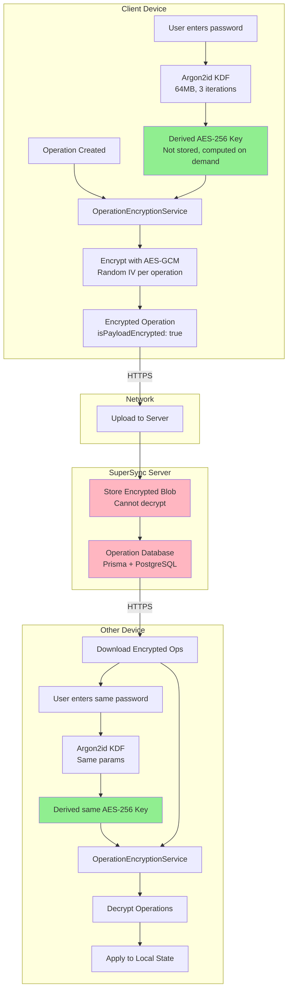
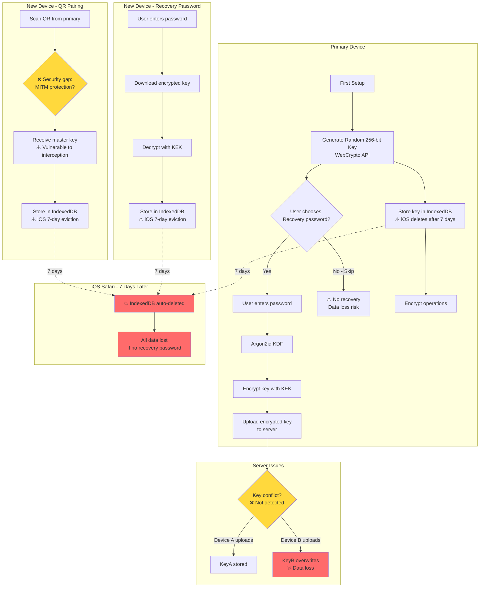
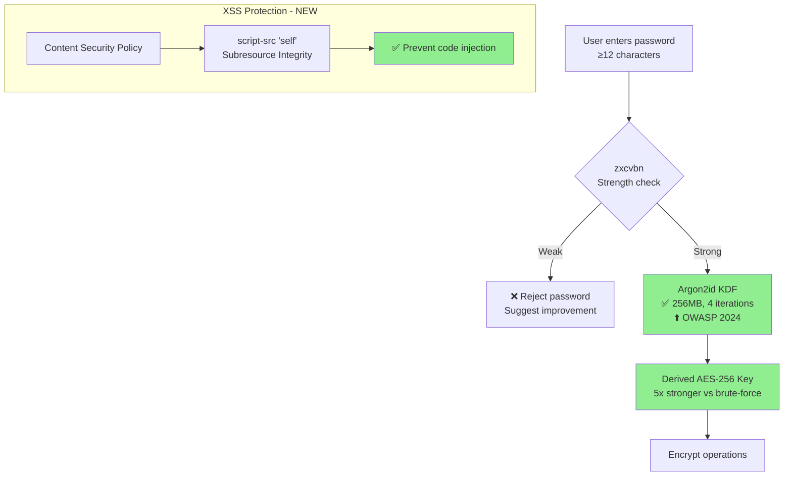
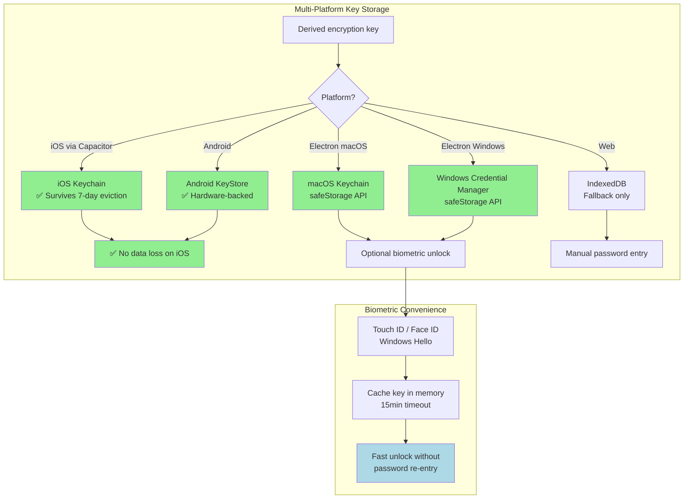
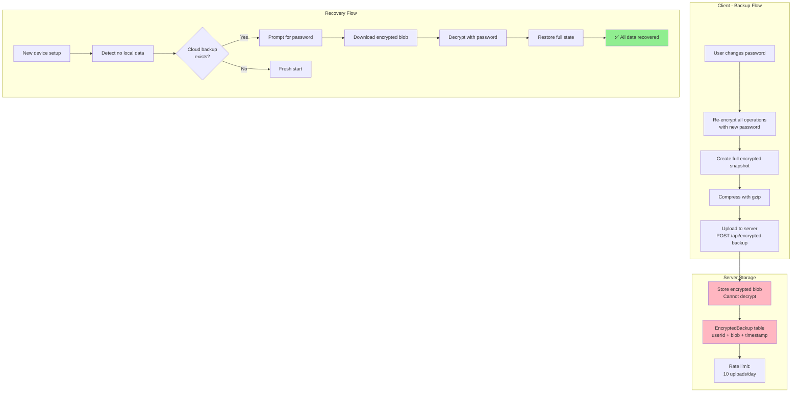
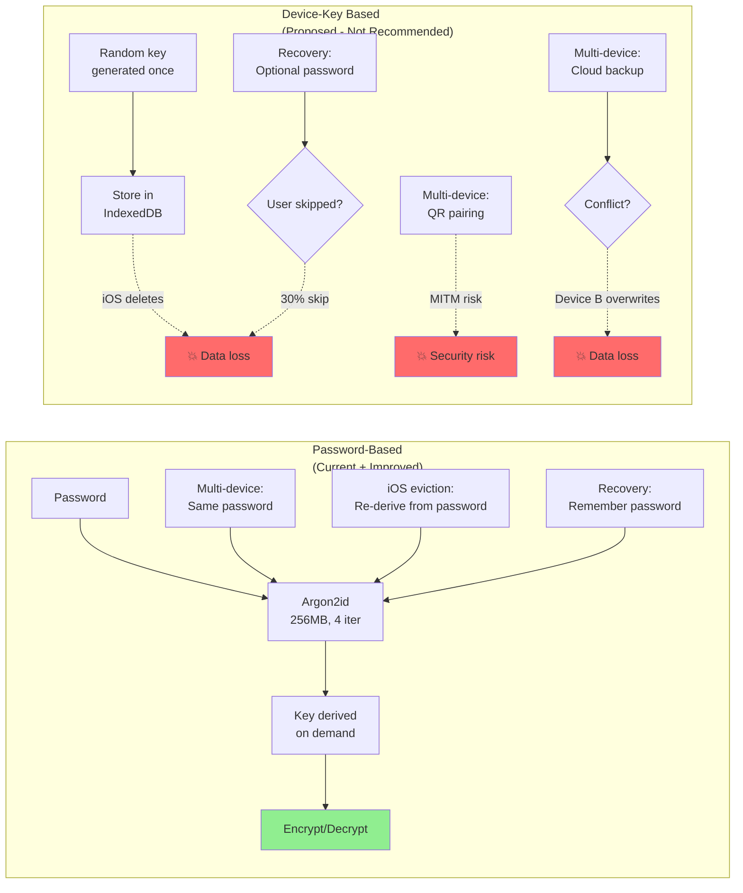
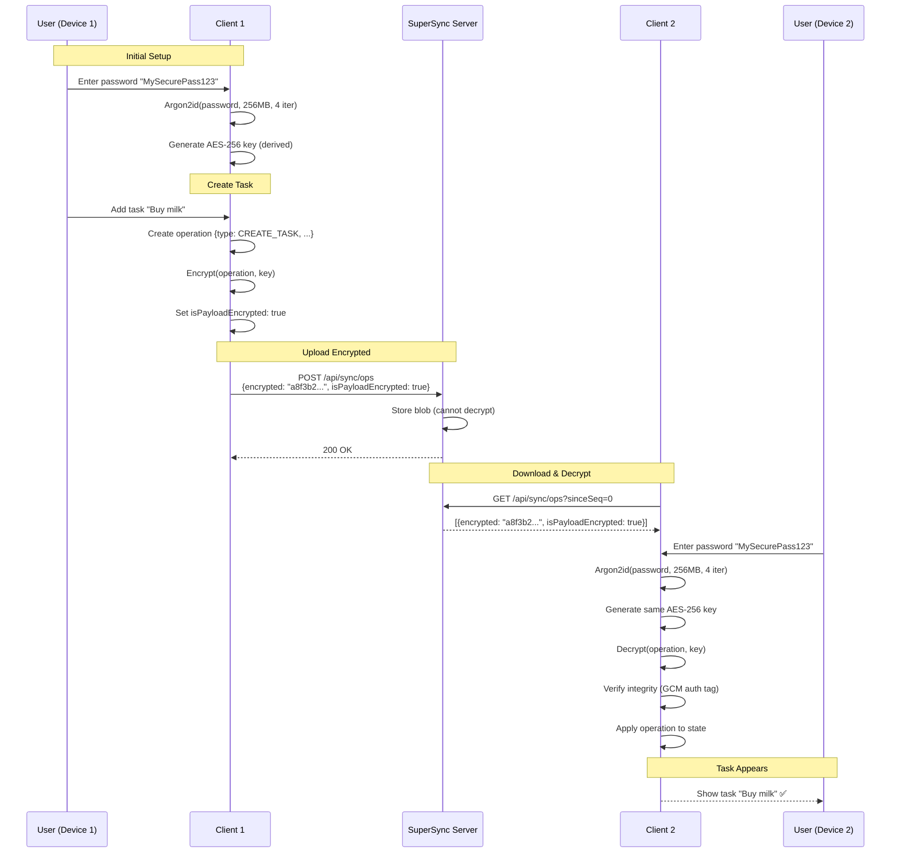
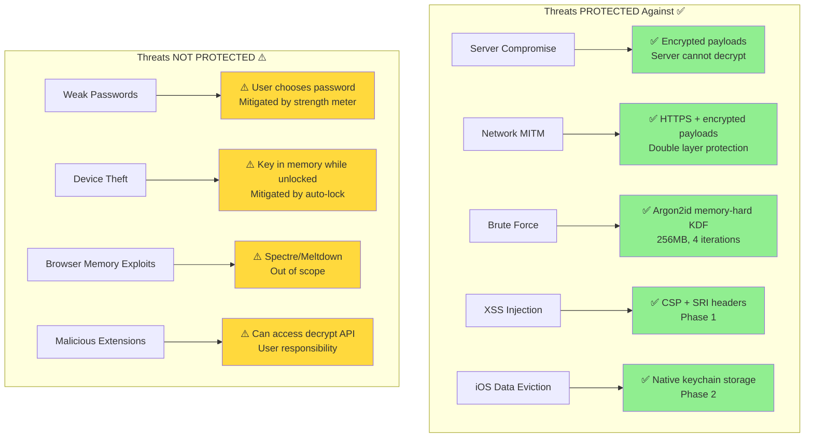
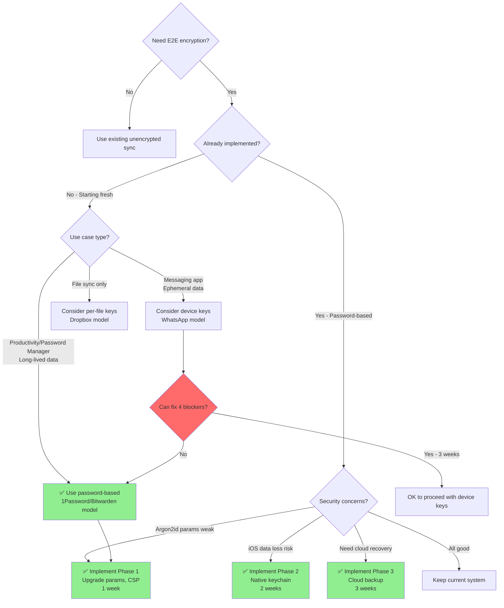
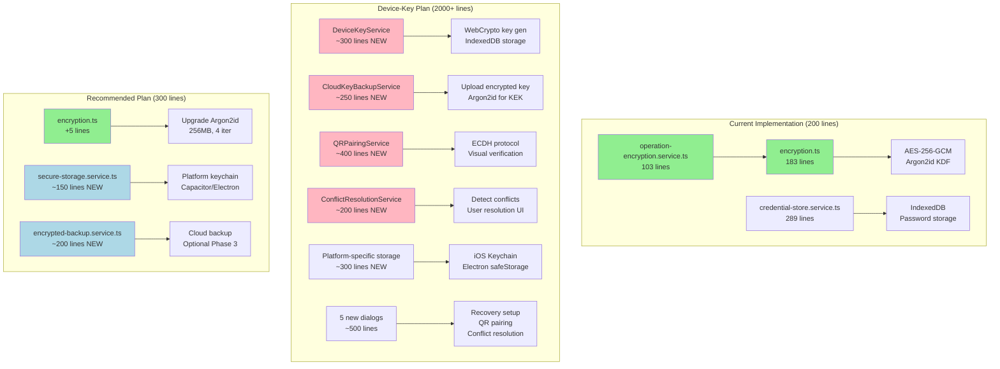

# E2E Encryption Architecture Diagrams

This document provides visual architecture diagrams comparing the current password-based encryption, the proposed device-key approach, and the recommended improvements.

---

## 1. Current Password-Based Encryption (Existing Implementation)



**Key Properties:**

- ✅ Same password derives same key on all devices
- ✅ Key never stored, always computed from password
- ✅ Survives IndexedDB deletion (re-derive from password)
- ✅ Server has zero knowledge of key or plaintext
- ⚠️ Password required on every device

---

## 2. Proposed Device-Key Approach (From Draft Plan)



**Critical Issues:**

- 🔴 **Blocker #1:** Non-extractable key contradiction (cannot export for backup)
- 🔴 **Blocker #2:** QR pairing has no MITM protection
- 🔴 **Blocker #3:** iOS Safari deletes IndexedDB after 7 days
- 🔴 **Blocker #4:** Key conflicts cause silent data loss

---

## 3. Recommended Improved Architecture (3-Phase Plan)

### Phase 1: Security Hardening (1 week)



**Improvements:**

- ✅ Upgraded Argon2id params (256MB, 4 iterations)
- ✅ Password strength enforcement
- ✅ CSP/SRI for XSS protection
- ⏱️ 1 week implementation

---

### Phase 2: Platform Resilience (2 weeks)



**Improvements:**

- ✅ Eliminates iOS 7-day data loss (native keychain)
- ✅ Biometric unlock for convenience
- ✅ Platform-specific secure storage
- ⏱️ 2 weeks implementation

---

### Phase 3: Cloud Backup (Optional - 3 weeks)



**Improvements:**

- ✅ Complete device loss recovery
- ✅ Password change safety net
- ✅ Server has zero knowledge (encrypted blobs)
- ⏱️ 3 weeks implementation
- ⚠️ Optional (only if user demand exists)

---

## 4. Security Comparison: Password vs Device Keys



---

## 5. Implementation Timeline Comparison

```mermaid
gantt
    title E2E Encryption Implementation Options
    dateFormat YYYY-MM-DD
    section Current (Exists)
    Working encryption     :done, curr1, 2024-01-01, 0d

    section Recommended Plan
    Phase 1: Security      :active, rec1, 2026-01-27, 1w
    Phase 2: Resilience    :rec2, after rec1, 2w
    Phase 3: Cloud Backup  :crit, rec3, after rec2, 3w
    Total: 6 weeks         :milestone, m1, after rec3, 0d

    section Device-Key Plan
    Fix Blocker #1         :crit, dev1, 2026-01-27, 2d
    Fix Blocker #2         :crit, dev2, after dev1, 5d
    Fix Blocker #3         :crit, dev3, after dev2, 3d
    Fix Blocker #4         :crit, dev4, after dev3, 3d
    Core Implementation    :dev5, after dev4, 8w
    Migration & Testing    :dev6, after dev5, 4w
    Total: 15 weeks        :milestone, m2, after dev6, 0d
```

---

## 6. Data Flow: Encryption & Sync



---

## 7. Threat Model: What's Protected vs Exposed



---

## 8. Decision Tree: Which Approach to Use



---

## 9. Code Architecture: Current vs Proposed



---

## Summary

### Current System ✅

- **Status:** Working, production-ready
- **Complexity:** Low (200 lines)
- **Security:** Strong (AES-256-GCM + Argon2id)
- **Gaps:** Argon2id params weak, no iOS resilience, no CSP

### Device-Key Proposal ❌

- **Status:** 4 critical blockers
- **Complexity:** High (2000+ lines)
- **Security:** Strong (when blockers fixed)
- **Issues:** 15 weeks, high risk, solves non-existent problems

### Recommended Plan ✅

- **Status:** Incremental improvements
- **Complexity:** Moderate (300 lines)
- **Security:** Strongest (OWASP 2024 + platform features)
- **Timeline:** 3-6 weeks, low risk

**Final Recommendation:** Implement the 3-phase improvement plan for the existing password-based encryption. Do not pursue device-generated keys.
