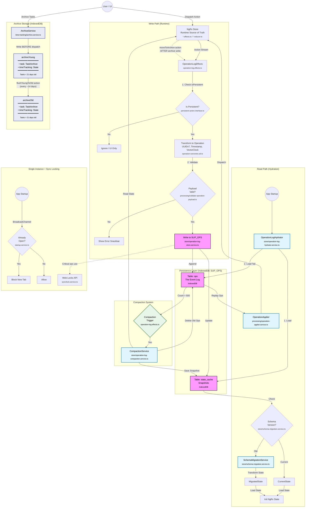

# Local Persistence Architecture

**Last Updated:** January 2026
**Status:** Implemented

This diagram illustrates how user actions flow through the system, how they are persisted to IndexedDB (`SUP_OPS`), and how the system hydrates on startup.

## Operation Log Architecture

## Archive Data Flow Notes

- **Archive writes happen BEFORE dispatch**: When a user archives tasks, `ArchiveService` writes to IndexedDB first, then dispatches the `moveToArchive` action. This ensures data is safely stored before state updates.
- **ArchiveModel structure**: Each archive tier stores `{ task: TaskArchive, timeTracking: TimeTrackingState, lastTimeTrackingFlush: number }`. Both archived Task entities AND their time tracking data are stored together.
- **Two-tier archive**: Recent tasks go to `archiveYoung` (tasks < 21 days old). Older tasks are flushed to `archiveOld` via `flushYoungToOld` action (checked every ~14 days when archiving tasks).
- **Flush mechanism**: `flushYoungToOld` is a persistent action that:
  1. Triggers when `lastTimeTrackingFlush > 14 days` during `moveTasksToArchiveAndFlushArchiveIfDue()`
  2. Moves tasks older than 21 days from `archiveYoung.task` to `archiveOld.task`
  3. Syncs via operation log so all clients execute the same flush deterministically
- **Not in NgRx state**: Archive data is stored directly in IndexedDB, not in the NgRx store. Only the operations (`moveToArchive`, `flushYoungToOld`) are logged for sync.
- **Sync handling**: On remote clients, `ArchiveOperationHandler` writes archive data AFTER receiving the operation (see [archive-operations.md](./06-archive-operations.md)).

## Key Files

| File                                                   | Purpose                                |
| ------------------------------------------------------ | -------------------------------------- |
| `op-log/effects/operation-log.effects.ts`              | Captures actions and writes operations |
| `op-log/store/operation-log-store.service.ts`          | IndexedDB wrapper for SUP_OPS          |
| `op-log/persistence/operation-log-hydrator.service.ts` | Startup hydration                      |
| `op-log/processing/operation-applier.service.ts`       | Replays operations to NgRx             |
| `features/time-tracking/archive.service.ts`            | Archive write logic                    |
