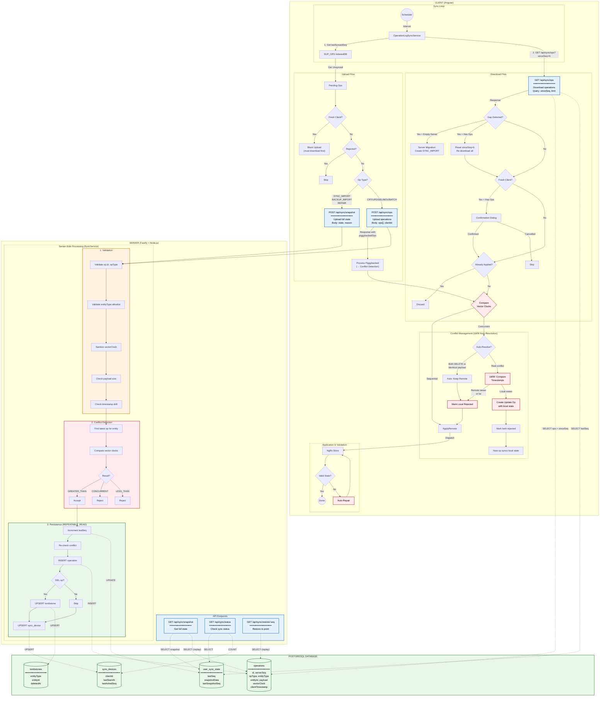
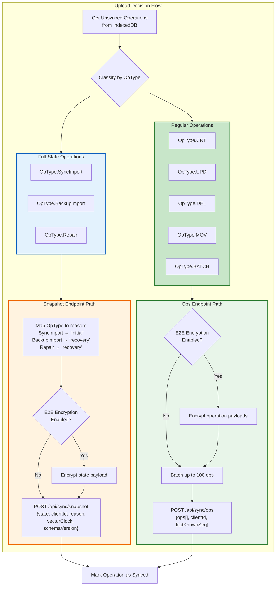
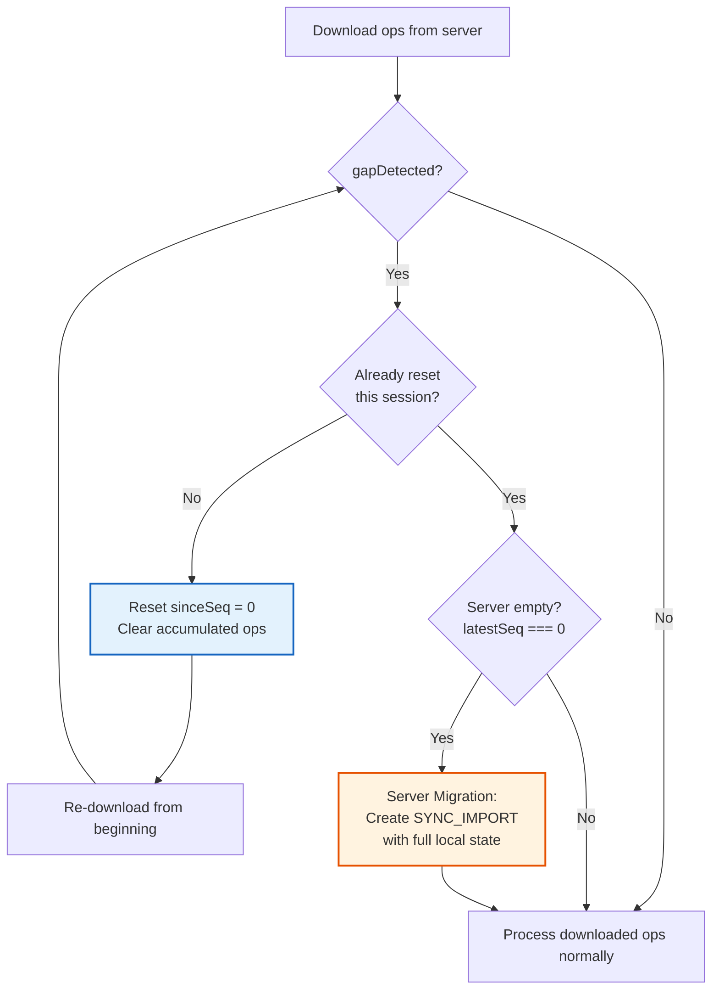

# Server Sync Architecture (SuperSync)

**Last Updated:** January 2026
**Status:** Implemented

This diagram shows the complete sync architecture for SuperSync: client-side flow, server API endpoints, PostgreSQL database operations, and server-side processing.

## Master Architecture Diagram

## Quick Reference Tables

### API Endpoints

| Endpoint                   | Method | Purpose                         | DB Operations                                                        |
| -------------------------- | ------ | ------------------------------- | -------------------------------------------------------------------- |
| `/api/sync/ops`            | POST   | Upload operations               | INSERT ops, UPDATE lastSeq, UPSERT device, UPSERT tombstone (if DEL) |
| `/api/sync/ops?sinceSeq=N` | GET    | Download operations             | SELECT ops, SELECT lastSeq, find latest snapshot (skip optimization) |
| `/api/sync/snapshot`       | POST   | Upload full state (SYNC_IMPORT) | Same as POST /ops + UPDATE snapshot cache                            |
| `/api/sync/snapshot`       | GET    | Get full state                  | SELECT snapshot (or replay ops if stale)                             |
| `/api/sync/status`         | GET    | Check sync status               | SELECT lastSeq, COUNT devices                                        |
| `/api/sync/restore-points` | GET    | List restore points             | SELECT ops (filter SYNC_IMPORT, BACKUP_IMPORT, REPAIR)               |
| `/api/sync/restore/:seq`   | GET    | Restore to specific point       | SELECT ops, replay to targetSeq                                      |

### PostgreSQL Tables

| Table             | Purpose                                    | Key Columns                                             |
| ----------------- | ------------------------------------------ | ------------------------------------------------------- |
| `operations`      | Event log (append-only)                    | id, serverSeq, opType, entityType, payload, vectorClock |
| `user_sync_state` | Per-user metadata + cached snapshot        | lastSeq, snapshotData, lastSnapshotSeq                  |
| `sync_devices`    | Device tracking                            | clientId, lastSeenAt, lastAckedSeq                      |
| `tombstones`      | Deleted entity tracking (30-day retention) | entityType, entityId, deletedAt, expiresAt              |

### Key Implementation Details

- **Transaction Isolation**: `REPEATABLE_READ` prevents phantom reads during conflict detection
- **Double Conflict Check**: Before AND after sequence allocation (race condition guard)
- **Idempotency**: Duplicate op IDs rejected with `DUPLICATE_OPERATION` error
- **Gzip Support**: Both upload/download support `Content-Encoding: gzip` for bandwidth savings
- **Rate Limiting**: Per-user limits (100 uploads/min, 200 downloads/min)
- **Auto-Resolve Conflicts (Identical)**: Identical conflicts (both DELETE, or same payload) auto-resolved as "remote" without user intervention
- **LWW Conflict Resolution**: Real conflicts are automatically resolved using Last-Write-Wins (timestamp comparison)
- **Fresh Client Safety**: Clients with no history blocked from uploading; confirmation dialog shown before accepting first remote data
- **Piggybacked Ops**: Upload response includes new remote ops → processed immediately to trigger conflict detection
- **Gap Detection**: Server returns `gapDetected: true` when client sinceSeq is invalid → client resets to seq=0 and re-downloads all ops
- **Server Migration**: Gap + empty server (no ops) → client creates SYNC_IMPORT to seed new server
- **Snapshot Skip Optimization**: Server skips pre-snapshot operations when `sinceSeq < latestSnapshotSeq`

## Full-State Operations via Snapshot Endpoint

Full-state operations (BackupImport, Repair, SyncImport) contain the entire application state and can exceed the regular `/api/sync/ops` body size limit (~30MB). These operations are routed through the `/api/sync/snapshot` endpoint instead.

## Gap Detection

Gap detection identifies situations where the client cannot reliably sync incrementally and must take corrective action.

### The Four Gap Cases

| Case | Condition                         | Meaning                             | Typical Cause                          |
| ---- | --------------------------------- | ----------------------------------- | -------------------------------------- |
| 1    | `sinceSeq > 0 && latestSeq === 0` | Client has history, server is empty | Server was reset/migrated              |
| 2    | `sinceSeq > latestSeq`            | Client is ahead of server           | Server DB restored from old backup     |
| 3    | `sinceSeq < minSeq - 1`           | Requested ops were purged           | Retention policy deleted old ops       |
| 4    | `firstOpSeq > sinceSeq + 1`       | Gap in sequence numbers             | Database corruption or manual deletion |

### Client-Side Handling

## Key Files

| File                                                    | Purpose                         |
| ------------------------------------------------------- | ------------------------------- |
| `src/app/op-log/sync/operation-log-sync.service.ts`     | Main sync orchestration         |
| `src/app/op-log/sync/operation-log-upload.service.ts`   | Upload logic                    |
| `src/app/op-log/sync/operation-log-download.service.ts` | Download logic                  |
| `src/app/op-log/sync/conflict-resolution.service.ts`    | LWW conflict resolution         |
| `src/app/op-log/sync/server-migration.service.ts`       | Server migration (empty server) |
| `packages/super-sync-server/src/sync/`                  | Server-side sync implementation |
