# Conflict Resolution & SYNC_IMPORT Filtering

**Last Updated:** January 2026
**Status:** Implemented

This document covers LWW (Last-Write-Wins) conflict auto-resolution and SYNC_IMPORT filtering with clean slate semantics.

## LWW (Last-Write-Wins) Conflict Auto-Resolution

When two clients make concurrent changes to the same entity, a conflict occurs. Rather than interrupting the user with a dialog, the system automatically resolves conflicts using **Last-Write-Wins (LWW)** based on operation timestamps.

### What is a Conflict?

A conflict occurs when vector clock comparison returns `CONCURRENT` - meaning neither operation "happened before" the other. They represent independent, simultaneous edits.

### LWW Resolution Algorithm

The winner is determined by comparing the **maximum timestamp** from each operation's vector clock. The operation with the later timestamp wins. Ties go to remote (to ensure convergence).

```mermaid
flowchart TD
    subgraph Input["Conflicting Operations"]
        Local["LOCAL Operation<br/>━━━━━━━━━━━━━━━<br/>vectorClock: {A:5, B:3}<br/>timestamps: [1702900000, 1702899000]<br/>maxTimestamp: 1702900000"]
        Remote["REMOTE Operation<br/>━━━━━━━━━━━━━━━<br/>vectorClock: {A:4, B:4}<br/>timestamps: [1702898000, 1702901000]<br/>maxTimestamp: 1702901000"]
    end

    subgraph Algorithm["LWW Comparison"]
        GetMax["Extract max timestamp<br/>from each vector clock"]
        Compare{"Compare<br/>Timestamps"}

        GetMax --> Compare

        Compare -->|"Local > Remote"| LocalWins["🏆 LOCAL WINS<br/>Local state preserved<br/>Create UPDATE op to sync"]
        Compare -->|"Remote > Local<br/>OR tie"| RemoteWins["🏆 REMOTE WINS<br/>Apply remote state<br/>Reject local op"]
    end

    Local --> GetMax
    Remote --> GetMax

    subgraph Outcome["Resolution Outcome"]
        LocalWins --> CreateOp["Create new UPDATE operation<br/>with current entity state<br/>+ merged vector clock"]
        RemoteWins --> MarkRejected["Mark local op as rejected<br/>Apply remote op"]

        CreateOp --> Sync["New op syncs to server<br/>Other clients receive update"]
        MarkRejected --> Apply["Remote state applied<br/>User sees change"]
    end

    style LocalWins fill:#e8f5e9,stroke:#2e7d32,stroke-width:2px
    style RemoteWins fill:#e3f2fd,stroke:#1565c0,stroke-width:2px
    style CreateOp fill:#c8e6c9,stroke:#2e7d32,stroke-width:2px
```

### Two Possible Outcomes

### Complete LWW Flow

### User Notification

```mermaid
flowchart LR
    subgraph Resolution["After LWW Resolution"]
        Resolved["Conflicts resolved"]
    end

    subgraph Notification["User Notification"]
        Snack["📋 Snackbar<br/>━━━━━━━━━━━━━━━<br/>'X conflicts were<br/>auto-resolved'<br/>━━━━━━━━━━━━━━━<br/>Non-blocking<br/>Auto-dismisses"]
    end

    subgraph Backup["Safety Net"]
        BackupCreated["💾 Safety Backup<br/>━━━━━━━━━━━━━━━<br/>Created BEFORE resolution<br/>User can restore if needed"]
    end

    Resolution --> Notification
    Resolution --> Backup

    style Snack fill:#fff3e0,stroke:#ef6c00,stroke-width:2px
    style BackupCreated fill:#e8f5e9,stroke:#2e7d32,stroke-width:2px
```

### Key Implementation Details

| Aspect                 | Implementation                                                              |
| ---------------------- | --------------------------------------------------------------------------- |
| **Timestamp Source**   | `Math.max(...Object.values(vectorClock))` - max timestamp from vector clock |
| **Tie Breaker**        | Remote wins (ensures convergence across all clients)                        |
| **Safety Backup**      | Created via `BackupService` before any resolution                           |
| **Local Win Update**   | New `OpType.UPD` operation created with merged vector clock                 |
| **Vector Clock Merge** | `mergeVectorClocks(localClock, remoteClock)` for local-win ops              |
| **Entity State**       | Retrieved from NgRx store via entity-specific selectors                     |
| **Notification**       | Non-blocking snackbar showing count of resolved conflicts                   |

---

## SYNC_IMPORT Filtering with Clean Slate Semantics

When a SYNC_IMPORT or BACKUP_IMPORT operation is received, it represents an explicit user action to restore **all clients** to a specific point in time. Operations created without knowledge of the import are filtered out using vector clock comparison.

### The Problem: Stale Operations After Import

### The Solution: Clean Slate Semantics

SYNC_IMPORT/BACKUP_IMPORT are explicit user actions to restore to a specific state. **ALL operations without knowledge of the import are dropped** - this ensures a true "restore to point in time" semantic.

We use **vector clock comparison** (not UUIDv7 timestamps) because vector clocks track **causality** ("did the client know about the import?") rather than wall-clock time (which can be affected by clock drift).

### Vector Clock Comparison Results

| Comparison     | Meaning                                | Action                     |
| -------------- | -------------------------------------- | -------------------------- |
| `GREATER_THAN` | Op created after seeing import         | ✅ Keep (has knowledge)    |
| `EQUAL`        | Same causal history as import          | ✅ Keep                    |
| `LESS_THAN`    | Op dominated by import                 | ❌ Drop (already captured) |
| `CONCURRENT`   | Op created without knowledge of import | ❌ Drop (clean slate)      |

### Why Vector Clocks Instead of UUIDv7?

Vector clocks track **causality** - whether a client "knew about" the import when it created an operation. UUIDv7 timestamps only track wall-clock time, which is unreliable due to clock drift between devices. An operation created 5 seconds after an import (by timestamp) may still reference entities that no longer exist if the client hadn't seen the import yet.

```mermaid
flowchart LR
    subgraph UUIDv7["❌ UUIDv7 Approach (Previous)"]
        direction TB
        U1["Client B's clock is 2 hours AHEAD"]
        U2["B creates op at REAL time 10:00"]
        U3["UUIDv7 timestamp = 12:00<br/>(wrong due to clock drift)"]
        U4["SYNC_IMPORT at 11:00"]
        U5["Filter check: 12:00 > 11:00"]
        U6["🐛 NOT FILTERED!<br/>Old op applied, corrupts state"]

        U1 --> U2 --> U3 --> U4 --> U5 --> U6
    end

    subgraph VectorClock["✅ Vector Clock Approach (Current)"]
        direction TB
        V1["Client B's clock is 2 hours AHEAD"]
        V2["B creates op (offline)"]
        V3["op.vectorClock = {A: 2, B: 3}<br/>(wall-clock time irrelevant)"]
        V4["SYNC_IMPORT.vectorClock = {A: 3}"]
        V5["Compare: {A:2,B:3} vs {A:3}<br/>Result: CONCURRENT"]
        V6["✅ FILTERED!<br/>Op created without knowledge of import"]

        V1 --> V2 --> V3 --> V4 --> V5 --> V6
    end

    style U6 fill:#ffcccc
    style V6 fill:#ccffcc
```

## Key Files

| File                                                    | Purpose                           |
| ------------------------------------------------------- | --------------------------------- |
| `src/app/op-log/sync/conflict-resolution.service.ts`    | LWW conflict auto-resolution      |
| `src/app/op-log/sync/sync-import-filter.service.ts`     | SYNC_IMPORT filtering logic       |
| `src/app/op-log/sync/operation-log-download.service.ts` | Download and apply remote ops     |
| `src/app/op-log/sync/vector-clock.service.ts`           | Vector clock comparison utilities |
