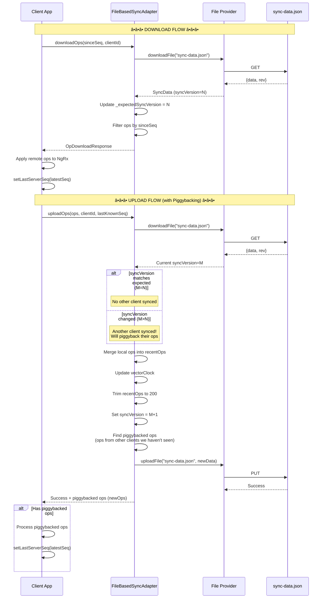

# File-Based Sync Architecture

**Last Updated:** January 2026
**Status:** Implemented

This document contains diagrams explaining the unified operation-log sync architecture for file-based providers (WebDAV, Dropbox, LocalFile).

## Overview

File-based sync uses a single `sync-data.json` file that contains:

- Full application state snapshot
- Recent operations buffer (last 200 ops)
- Vector clock for conflict detection
- Archive data for late-joining clients

```mermaid
flowchart TB
    subgraph Remote["Remote Storage (WebDAV/Dropbox/LocalFile)"]
        subgraph Folder["/superProductivity/"]
            SyncFile["sync-data.json<br/>â”â”â”â”â”â”â”â”â”â”â”â”â”â”â”â”â”â”â”<br/>Encrypted + Compressed"]
        end
    end

    subgraph Contents["sync-data.json Contents"]
        direction TB
        Meta["📋 Metadata<br/>• version: 2<br/>• syncVersion: N (locking)<br/>• schemaVersion<br/>• lastModified<br/>• clientId<br/>• checksum"]

        VClock["🕠Vector Clock<br/>• {clientA: 42, clientB: 17}<br/>• Tracks causality"]

        State["📦 State Snapshot<br/>â”â”â”â”â”â”â”â”â”â”â”â”â”â”â”â”â”â”â”<br/>• tasks: TaskState<br/>• projects: ProjectState<br/>• tags: TagState<br/>• notes: NoteState<br/>• globalConfig<br/>• issueProviders<br/>• planner<br/>• simpleCounters<br/>• taskRepeatCfg"]

        Archive["📠Archive Data<br/>â”â”â”â”â”â”â”â”â”â”â”â”â”â”â”â”â”â”â”<br/>• archiveYoung: ArchiveModel<br/>• archiveOld: ArchiveModel<br/>â”â”â”â”â”â”â”â”â”â”â”â”â”â”â”â”â”â”â”<br/>Ensures late-joiners get<br/>full archive history"]

        Ops["📠Recent Operations (last 200)<br/>â”â”â”â”â”â”â”â”â”â”â”â”â”â”â”â”â”â”â”<br/>• id, clientId, actionType<br/>• opType, entityType, entityId<br/>• payload, vectorClock<br/>• timestamp<br/>â”â”â”â”â”â”â”â”â”â”â”â”â”â”â”â”â”â”â”<br/>Used for conflict detection"]
    end

    SyncFile --> Contents

    style SyncFile fill:#fff3e0,stroke:#e65100,stroke-width:2px
    style State fill:#e8f5e9,stroke:#2e7d32,stroke-width:2px
    style Archive fill:#fce4ec,stroke:#c2185b,stroke-width:2px
    style Ops fill:#e1f5fe,stroke:#01579b,stroke-width:2px
```

### Why Single File Instead of Separate Snapshot + Ops Files?

| Single File (chosen)        | Two Files (considered)      |
| --------------------------- | --------------------------- |
| Atomic: all or nothing      | Partial upload risk         |
| One version to track        | Version coordination        |
| Simple conflict resolution  | Two places to handle        |
| Easy recovery               | Inconsistent state possible |
| Upload full state each time | Often just ops              |

The bandwidth cost is acceptable: state compresses well (~90%), and sync is infrequent.

## Architecture Overview

Shows how `FileBasedSyncAdapter` integrates into the existing op-log system, implementing `OperationSyncCapable` using file operations.

```mermaid
flowchart TB
    subgraph Client["Client Application"]
        NgRx["NgRx Store<br/>(Runtime State)"]
        OpLogEffects["OperationLogEffects"]
        OpLogStore["SUP_OPS IndexedDB<br/>(ops + state_cache)"]

        subgraph SyncServices["Sync Services"]
            SyncService["OperationLogSyncService"]
            ConflictRes["ConflictResolutionService"]
            VectorClock["VectorClockService"]
        end

        subgraph ProviderLayer["Provider Abstraction"]
            FileAdapter["FileBasedSyncAdapter<br/>(implements OperationSyncCapable)"]
            SuperSync["SuperSyncProvider<br/>(existing API-based)"]

            subgraph FileProviders["File Providers"]
                WebDAV["WebDAV"]
                Dropbox["Dropbox"]
                LocalFile["LocalFile"]
            end
        end
    end

    subgraph RemoteStorage["Remote Storage"]
        SyncFile["sync-data.json<br/>â”â”â”â”â”â”â”â”â”â”â”â”â”â”â”<br/>• syncVersion<br/>• state snapshot<br/>• recentOps (200)<br/>• vectorClock"]
    end

    NgRx --> OpLogEffects
    OpLogEffects --> OpLogStore
    OpLogStore --> SyncService
    SyncService --> ConflictRes
    SyncService --> VectorClock

    SyncService --> FileAdapter
    SyncService --> SuperSync

    FileAdapter --> WebDAV
    FileAdapter --> Dropbox
    FileAdapter --> LocalFile

    WebDAV --> SyncFile
    Dropbox --> SyncFile
    LocalFile --> SyncFile

    style FileAdapter fill:#e1f5fe,stroke:#01579b,stroke-width:2px
    style SyncFile fill:#fff3e0,stroke:#e65100,stroke-width:2px
    style OpLogStore fill:#e8f5e9,stroke:#2e7d32,stroke-width:2px
```

## TypeScript Types

## Sync Flow (Content-Based Optimistic Locking with Piggybacking)

### Key Insight: Piggybacking

Instead of throwing an error on version mismatch, the adapter:

1. Merges local ops with whatever is in the file
2. Returns ops from other clients as `newOps` (piggybacked)
3. The upload service processes these before updating `lastServerSeq`

This ensures no ops are missed, even when clients sync concurrently.

## Conflict Resolution (Two Clients Syncing Simultaneously)

```mermaid
sequenceDiagram
    participant A as Client A
    participant B as Client B
    participant File as sync-data.json<br/>(syncVersion: 5)

    Note over A,File: Initial: syncVersion=5, both clients synced

    rect rgb(232, 245, 233)
        Note over A,B: Both make offline changes
        A->>A: Create Task X
        A->>A: expectedSyncVersion = 5
        B->>B: Update Task Y
        B->>B: expectedSyncVersion = 5
    end

    Note over A,File: Race condition begins

    A->>File: Upload starts (downloads file, sees v=5)
    B->>File: Upload starts (downloads file, sees v=5)

    A->>A: Merge ops [TaskX], set syncVersion=6
    A->>File: Upload sync-data.json (v=6)
    Note over A,File: A wins the race ✓
    File-->>A: Success
    A->>A: expectedSyncVersion = 6

    B->>B: Merge ops [TaskY]
    Note over B: Downloads file again for upload...
    B->>File: Download (sees syncVersion=6!)
    Note over B,File: Version changed!<br/>Expected 5, found 6

    rect rgb(225, 245, 254)
        Note over B: Piggybacking (not retry!)
        B->>B: Find piggybacked ops from file<br/>(A's TaskX op, seq > lastProcessedSeq)
        B->>B: Merge [TaskX, TaskY] into recentOps
        B->>B: Set syncVersion = 7
        B->>File: Upload sync-data.json (v=7)
        File-->>B: Success ✓

        B->>B: Return piggybacked=[TaskX]
        B->>B: Process TaskX op → apply to NgRx
        B->>B: setLastServerSeq(latestSeq)
    end

    Note over A,File: A syncs B's TaskY on next sync
    A->>File: Download (sinceSeq=6)
    File-->>A: ops=[TaskY]
    A->>A: Apply TaskY → both clients have both tasks
```

### How Piggybacking Resolves Conflicts

| Step                         | What Happens                                                |
| ---------------------------- | ----------------------------------------------------------- |
| 1. Version mismatch detected | B expected v=5, found v=6                                   |
| 2. No retry needed           | B proceeds with merge anyway                                |
| 3. Find piggybacked ops      | Ops in file with seq > lastProcessedSeq, from other clients |
| 4. Merge and upload          | B's ops + file's ops → new file                             |
| 5. Return piggybacked        | Upload response includes A's ops                            |
| 6. Process piggybacked       | Upload service applies them before advancing lastServerSeq  |

**LWW (Last-Write-Wins) for Same Entity:**

If both A and B modified the same task, the piggybacked ops flow through `ConflictResolutionService` which uses vector clocks and timestamps to determine the winner.

## First-Sync Conflict Handling

When a client with local data syncs for the first time to a remote that already has data, a conflict dialog is shown:

## Complete System Flow

## Key Points

1. **Single Sync File**: All data in `sync-data.json` - state snapshot + recent ops + vector clock
2. **Content-Based Versioning**: `syncVersion` counter detects conflicts without server ETags
3. **Piggybacking on Upload**: Version mismatch doesn't throw - ops from other clients are returned as `newOps`
4. **Sequence Counter Separation**:
   - `_expectedSyncVersions`: Tracks file's syncVersion (for version mismatch detection)
   - `_localSeqCounters`: Tracks ops we've processed (updated via `setLastServerSeq`)
5. **Archive via Op-Log**: Archive operations sync; `ArchiveOperationHandler` writes data
6. **Deterministic Replay**: Same operation + same timestamp = same result everywhere

## Implementation Files

| File                                                                               | Purpose                        |
| ---------------------------------------------------------------------------------- | ------------------------------ |
| `src/app/op-log/sync-providers/file-based/file-based-sync-adapter.service.ts`      | Main adapter (~800 LOC)        |
| `src/app/op-log/sync-providers/file-based/file-based-sync.types.ts`                | TypeScript types and constants |
| `src/app/op-log/sync-providers/file-based/file-based-sync-adapter.service.spec.ts` | Unit tests                     |
