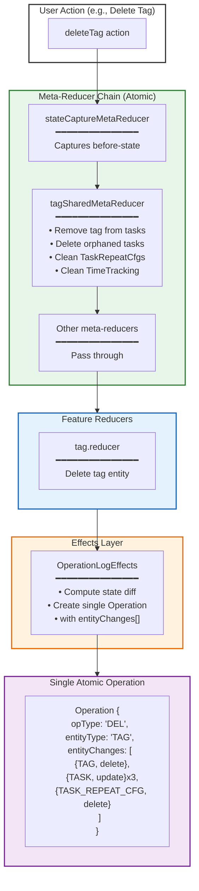
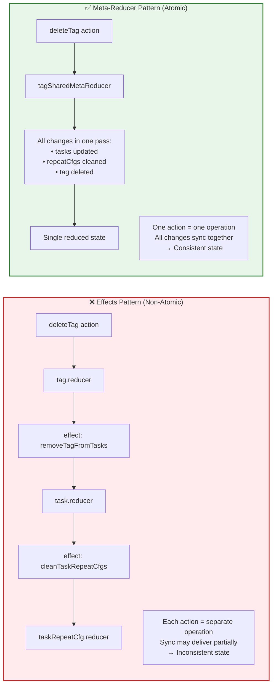
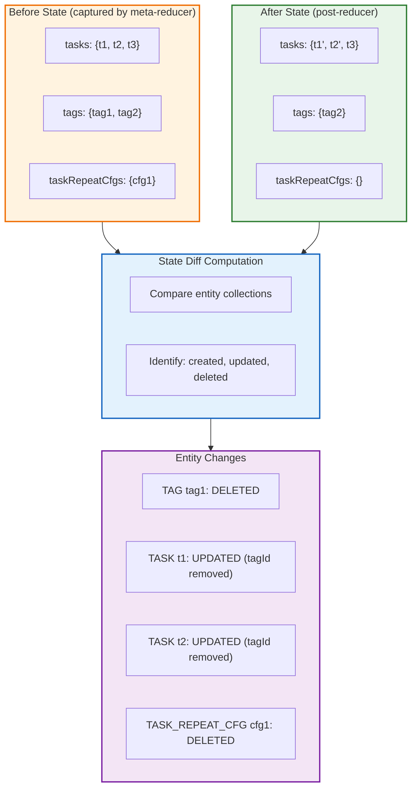
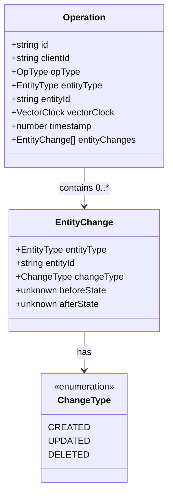
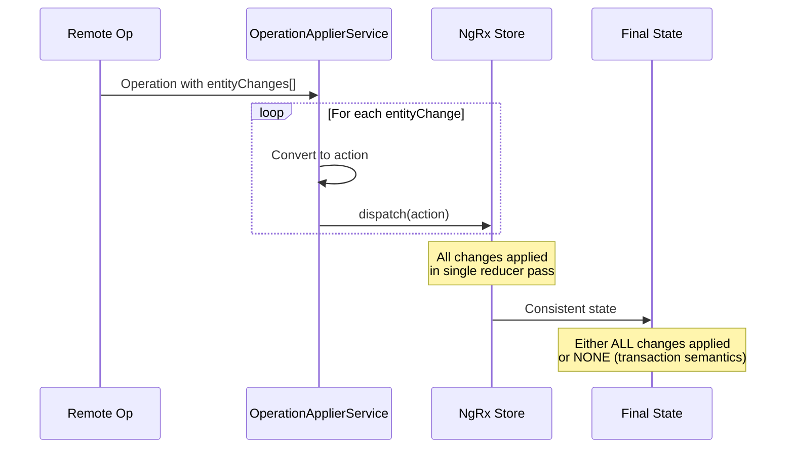
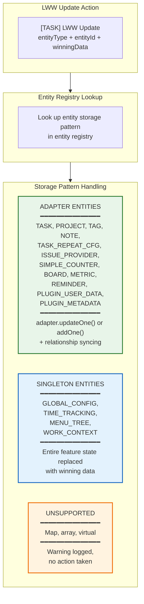

# Atomic State Consistency (Meta-Reducer Pattern)

**Last Updated:** January 2026
**Status:** Implemented

This document illustrates how meta-reducers ensure atomic state changes across multiple entities, preventing inconsistency during sync.

## Meta-Reducer Flow for Multi-Entity Operations

## Why Meta-Reducers vs Effects

## State Change Detection

The `StateChangeCaptureService` computes entity changes by comparing before and after states:

## Multi-Entity Operations That Use Meta-Reducers

| Action              | Entities Affected                                             | Meta-Reducer               |
| ------------------- | ------------------------------------------------------------- | -------------------------- |
| `deleteTag`         | Tag, Tasks (remove tagId), TaskRepeatCfgs, TimeTracking       | `tagSharedMetaReducer`     |
| `deleteTags`        | Tags, Tasks, TaskRepeatCfgs, TimeTracking                     | `tagSharedMetaReducer`     |
| `deleteProject`     | Project, Tasks (cascade delete), TaskRepeatCfgs, TimeTracking | `projectSharedMetaReducer` |
| `convertToMainTask` | Parent task, Child task, Sub-tasks                            | `taskSharedMetaReducer`    |
| `moveTaskUp/Down`   | Multiple tasks (reorder)                                      | `taskSharedMetaReducer`    |

## Operation Structure with Entity Changes

## Sync Replay: All-or-Nothing

When remote operations are applied, all entity changes are replayed atomically:

## LWW Update Meta-Reducer: Entity Type Handling

The `lwwUpdateMetaReducer` handles LWW Update actions (created when the local side wins a conflict). It distinguishes between three entity storage patterns:

### Adapter Entity Details

For adapter-backed entities, the meta-reducer handles two sub-cases:

| Condition              | Behavior                                                  | Why                                                                                |
| ---------------------- | --------------------------------------------------------- | ---------------------------------------------------------------------------------- |
| Entity exists in store | `adapter.updateOne()` — replaces entity with winning data | Normal conflict resolution                                                         |
| Entity NOT in store    | `adapter.addOne()` — recreates entity                     | Handles DELETE vs UPDATE race (entity was deleted locally but update won remotely) |

### Relationship Syncing for Tasks

After updating a task via LWW, the meta-reducer syncs related entity references:

| Field Changed | Relationship Synced                                                |
| ------------- | ------------------------------------------------------------------ |
| `projectId`   | `project.taskIds` updated to reflect new/old project membership    |
| `tagIds`      | `tag.taskIds` updated for each added/removed tag                   |
| `dueDay`      | `TODAY_TAG.taskIds` updated (virtual tag, membership via `dueDay`) |
| `parentId`    | `parent.subTaskIds` updated for new/old parent task                |

**Key file:** `src/app/root-store/meta/task-shared-meta-reducers/lww-update.meta-reducer.ts`

## Key Files

| File                                                                           | Purpose                                                   |
| ------------------------------------------------------------------------------ | --------------------------------------------------------- |
| `src/app/root-store/meta/task-shared-meta-reducers/`                           | Task-related multi-entity changes                         |
| `src/app/root-store/meta/task-shared-meta-reducers/tag-shared.reducer.ts`      | Tag deletion with cleanup                                 |
| `src/app/root-store/meta/task-shared-meta-reducers/project-shared.reducer.ts`  | Project deletion with cleanup                             |
| `src/app/root-store/meta/task-shared-meta-reducers/lww-update.meta-reducer.ts` | LWW Update handling (adapter/singleton/relationship sync) |
