# Archive Operations & Side Effects

**Last Updated:** January 2026
**Status:** Implemented

This section documents how archive-related side effects are handled, establishing the general rule that **effects should never run for remote operations**.

## The General Rule: Effects Only for Local Actions

```mermaid
flowchart TD
    subgraph Rule["🔒 GENERAL RULE"]
        R1["All NgRx effects MUST use LOCAL_ACTIONS"]
        R2["Effects should NEVER run for remote operations"]
        R3["Side effects for remote ops are handled<br/>explicitly by OperationApplierService"]
    end

    subgraph Why["Why This Matters"]
        W1["• Prevents duplicate side effects"]
        W2["• Makes sync behavior predictable"]
        W3["• Side effects happen exactly once<br/>(on originating client)"]
        W4["• Receiving clients only update state"]
    end

    Rule --> Why

    style Rule fill:#e8f5e9,stroke:#2e7d32,stroke-width:3px
    style Why fill:#e3f2fd,stroke:#1565c0,stroke-width:2px
```

## Dual-Database Architecture

Super Productivity uses **two separate IndexedDB databases** for persistence:

```mermaid
flowchart TB
    subgraph Browser["Browser IndexedDB"]
        subgraph SUPOPS["SUP_OPS Database (Operation Log)"]
            direction TB
            OpsTable["ops table<br/>━━━━━━━━━━━━━━━<br/>Operation event log<br/>UUIDv7, vectorClock, payload"]
            StateCache["state_cache table<br/>━━━━━━━━━━━━━━━<br/>NgRx state snapshots<br/>for fast hydration"]
        end

        subgraph ArchiveDB["Archive Database"]
            direction TB
            ArchiveYoung["archiveYoung<br/>━━━━━━━━━━━━━━━<br/>ArchiveModel:<br/>• task: TaskArchive<br/>• timeTracking: State<br/>━━━━━━━━━━━━━━━<br/>Tasks < 21 days old"]
            ArchiveOld["archiveOld<br/>━━━━━━━━━━━━━━━<br/>ArchiveModel:<br/>• task: TaskArchive<br/>• timeTracking: State<br/>━━━━━━━━━━━━━━━<br/>Tasks > 21 days old"]
        end
    end

    subgraph Writers["What Writes Where"]
        OpLog["OperationLogStoreService"] -->|ops, snapshots| SUPOPS
        Archive["ArchiveService<br/>ArchiveOperationHandler"] -->|"ArchiveModel:<br/>tasks + time tracking"| ArchiveDB
    end

    style SUPOPS fill:#e8f5e9,stroke:#2e7d32,stroke-width:2px
    style ArchiveDB fill:#fff3e0,stroke:#ef6c00,stroke-width:2px
    style Writers fill:#e3f2fd,stroke:#1565c0,stroke-width:2px
```

**Key Points:**

| Database   | Purpose                        | Written By                                  |
| ---------- | ------------------------------ | ------------------------------------------- |
| `SUP_OPS`  | Operation log (event sourcing) | `OperationLogStoreService`                  |
| Archive DB | Archive data, time tracking    | `ArchiveService`, `ArchiveOperationHandler` |

## Archive Operations Flow

Archive data is stored in a separate IndexedDB database, **not** in NgRx state or the operation log. This requires special handling through a **unified** `ArchiveOperationHandler`:

- **Local operations**: `ArchiveOperationHandlerEffects` routes through `ArchiveOperationHandler` (using LOCAL_ACTIONS)
- **Remote operations**: `OperationApplierService` calls `ArchiveOperationHandler` directly after dispatch

Both paths use the same handler to ensure consistent behavior.

## ArchiveOperationHandler Integration

The `OperationApplierService` uses a **fail-fast** approach: if hard dependencies are missing, it throws `SyncStateCorruptedError` rather than attempting complex retry logic. This triggers a full re-sync, which is safer than partial recovery.

```mermaid
flowchart TD
    subgraph OperationApplierService["OperationApplierService (Fail-Fast)"]
        OA1[Receive operation] --> OA2{Check hard<br/>dependencies}
        OA2 -->|Missing| OA_ERR["throw SyncStateCorruptedError<br/>(triggers full re-sync)"]
        OA2 -->|OK| OA3[convertOpToAction]
        OA3 --> OA4["store.dispatch(action)<br/>with meta.isRemote=true"]
        OA4 --> OA5["archiveOperationHandler<br/>.handleOperation(action)"]
    end

    subgraph Handler["ArchiveOperationHandler"]
        H1{Action Type?}
        H1 -->|moveToArchive| H2[Write tasks to<br/>archiveYoung<br/>REMOTE ONLY]
        H1 -->|restoreTask| H3[Delete task from<br/>archive]
        H1 -->|flushYoungToOld| H4[Move old tasks<br/>Young → Old]
        H1 -->|deleteProject| H5[Remove tasks<br/>for project +<br/>cleanup time tracking]
        H1 -->|deleteTag/deleteTags| H6[Remove tag<br/>from tasks +<br/>cleanup time tracking]
        H1 -->|deleteTaskRepeatCfg| H7[Remove repeatCfgId<br/>from tasks]
        H1 -->|deleteIssueProvider| H8[Unlink issue data<br/>from tasks]
        H1 -->|deleteIssueProviders| H8b[Unlink multiple<br/>issue providers]
        H1 -->|other| H9[No-op]
    end

    OA5 --> H1

    style OperationApplierService fill:#e3f2fd,stroke:#1565c0,stroke-width:2px
    style Handler fill:#fff3e0,stroke:#ef6c00,stroke-width:2px
    style OA_ERR fill:#ffcdd2,stroke:#c62828,stroke-width:2px
```

**Why Fail-Fast?**

The server guarantees operations arrive in sequence order, and delete operations are atomic via meta-reducers. If dependencies are missing, something is fundamentally wrong with sync state. A full re-sync is safer than attempting partial recovery with potential inconsistencies.

## Archive Operations Summary

| Operation              | Local Handling                                                         | Remote Handling                                              |
| ---------------------- | ---------------------------------------------------------------------- | ------------------------------------------------------------ |
| `moveToArchive`        | ArchiveService writes BEFORE dispatch; handler skips (no double-write) | ArchiveOperationHandler writes AFTER dispatch                |
| `restoreTask`          | ArchiveOperationHandlerEffects → ArchiveOperationHandler               | ArchiveOperationHandler removes from archive                 |
| `flushYoungToOld`      | ArchiveOperationHandlerEffects → ArchiveOperationHandler               | ArchiveOperationHandler executes flush                       |
| `deleteProject`        | ArchiveOperationHandlerEffects → ArchiveOperationHandler               | ArchiveOperationHandler removes tasks + cleans time tracking |
| `deleteTag/deleteTags` | ArchiveOperationHandlerEffects → ArchiveOperationHandler               | ArchiveOperationHandler removes tags + cleans time tracking  |
| `deleteTaskRepeatCfg`  | ArchiveOperationHandlerEffects → ArchiveOperationHandler               | ArchiveOperationHandler removes repeatCfgId from tasks       |
| `deleteIssueProvider`  | ArchiveOperationHandlerEffects → ArchiveOperationHandler               | ArchiveOperationHandler unlinks issue data                   |

## Archive Resurrection Prevention (Two-Level Defense)

When multiple clients are syncing concurrently, a race condition can cause archived tasks to "resurrect" — reappearing in the active store after being archived. This happens when a field-level LWW Update (e.g., rename, time tracking) arrives for a task that was concurrently archived.

The system uses a **two-level defense** to prevent this:

### Level 1: ConflictResolutionService (Archive-Wins Rule)

During LWW conflict resolution, if a `moveToArchive` operation conflicts with a field-level update, the **archive always wins** regardless of timestamps. This prevents the LWW update from overriding the archive intent.

**Key file:** `src/app/op-log/sync/conflict-resolution.service.ts`

### Level 2: bulkOperationsMetaReducer (Pre-Scan Filtering)

During bulk operation application (sync/hydration), the meta-reducer **pre-scans** the entire batch for `TASK_SHARED_MOVE_TO_ARCHIVE` operations. It collects all entity IDs being archived, then **skips** any `[TASK] LWW Update` operations targeting those entities.

This handles the **3+ client scenario** where LWW Updates can appear before or after archive ops in the same batch, bypassing Level 1 conflict resolution.

```mermaid
flowchart TD
    subgraph Level2["Level 2: Bulk Operations Meta-Reducer"]
        B1["Receive batch of operations<br/>[LWW Update, moveToArchive, ...]"]
        B1 --> B2["PRE-SCAN: Collect all<br/>entity IDs being archived"]
        B2 --> B3["For each operation in batch:"]
        B3 --> B4{"Is this an LWW Update<br/>for an archived entity?"}
        B4 -->|"Yes"| B5["⛔ SKIP<br/>(prevents resurrection)"]
        B4 -->|"No"| B6["✅ Apply normally"]
    end

    style Level2 fill:#e3f2fd,stroke:#1565c0,stroke-width:2px
    style B5 fill:#ffcdd2,stroke:#c62828,stroke-width:2px
```

**Key file:** `src/app/op-log/apply/bulk-hydration.meta-reducer.ts`

### Why Two Levels?

| Scenario                                                | Level 1 (Conflict Resolution)              | Level 2 (Bulk Pre-Scan) |
| ------------------------------------------------------- | ------------------------------------------ | ----------------------- |
| 2 clients: archive vs field update                      | ✅ Catches in LWW resolution               | N/A (not in same batch) |
| 3+ clients: LWW Update arrives in same batch as archive | May not detect (already resolved upstream) | ✅ Catches via pre-scan |
| Hydration replay with mixed ops                         | N/A (not conflict resolution)              | ✅ Catches via pre-scan |

## Key Files

| File                                                        | Purpose                                                             |
| ----------------------------------------------------------- | ------------------------------------------------------------------- |
| `src/app/op-log/apply/archive-operation-handler.service.ts` | **Unified** handler for all archive side effects (local AND remote) |
| `src/app/op-log/apply/archive-operation-handler.effects.ts` | Routes local actions to ArchiveOperationHandler via LOCAL_ACTIONS   |
| `src/app/op-log/apply/operation-applier.service.ts`         | Calls ArchiveOperationHandler after dispatching remote operations   |
| `src/app/op-log/sync/conflict-resolution.service.ts`        | Archive-wins rule during LWW conflict resolution                    |
| `src/app/op-log/apply/bulk-hydration.meta-reducer.ts`       | Pre-scan archive filtering during bulk application                  |
| `src/app/features/archive/archive.service.ts`               | Local archive write logic (moveToArchive writes BEFORE dispatch)    |
| `src/app/features/archive/task-archive.service.ts`          | Archive CRUD operations                                             |
