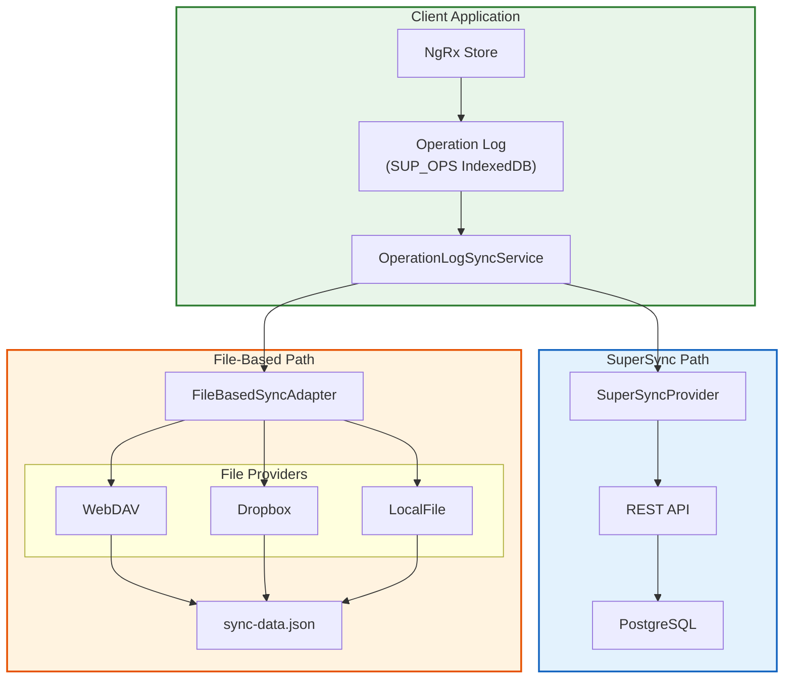
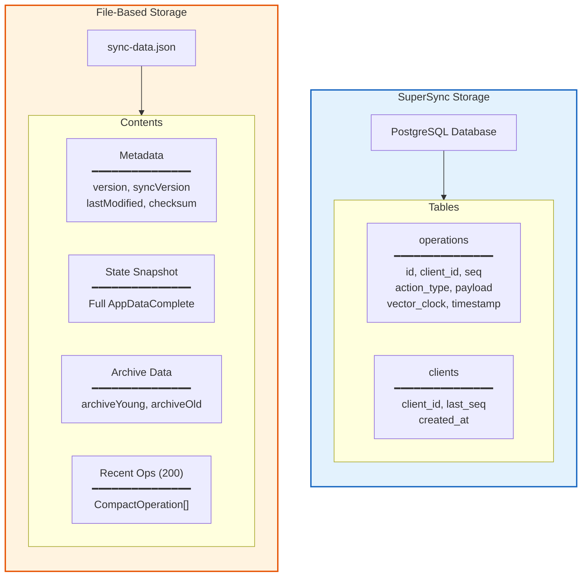
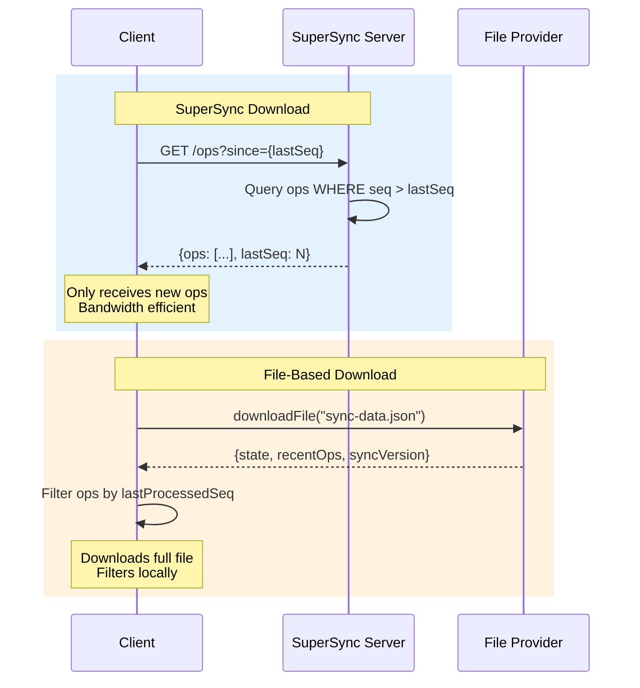
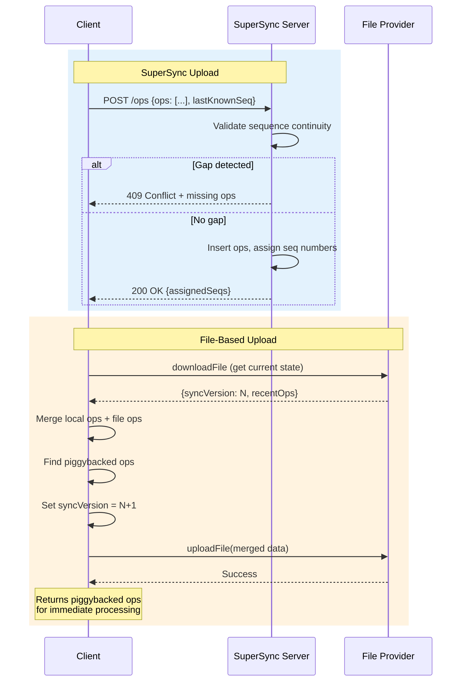
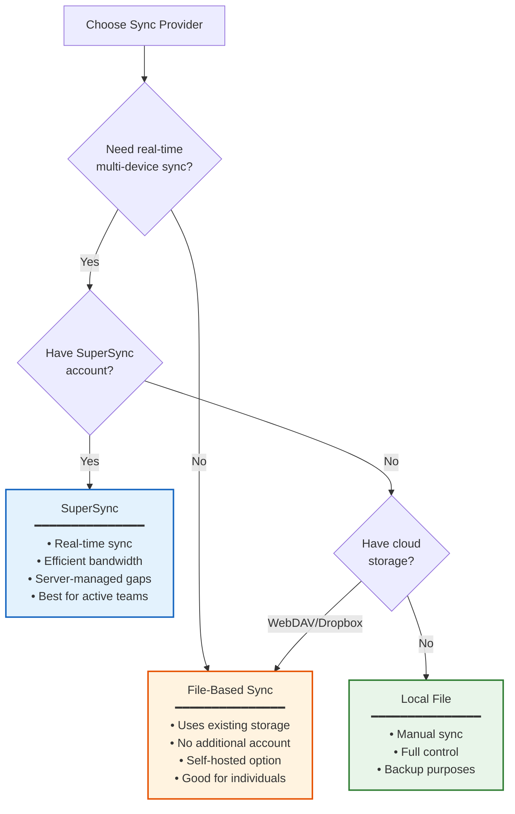

# SuperSync vs File-Based Sync Comparison

**Last Updated:** January 2026
**Status:** Implemented

This document compares the two sync provider architectures: SuperSync (server-based) and File-Based (WebDAV/Dropbox/LocalFile).

## High-Level Architecture Comparison

## Feature Comparison

| Feature                | SuperSync                 | File-Based                        |
| ---------------------- | ------------------------- | --------------------------------- |
| **Storage**            | PostgreSQL database       | Single JSON file                  |
| **Operations**         | Stored individually       | Buffered (last 200)               |
| **State Snapshot**     | Not stored (derived)      | Included in sync file             |
| **Archive Data**       | Via operation replay      | Embedded in sync file             |
| **Conflict Detection** | Server sequence numbers   | syncVersion counter               |
| **Gap Detection**      | Server validates sequence | Client-side via lastSeq           |
| **Concurrency**        | Server handles locks      | Optimistic locking + piggybacking |
| **Bandwidth**          | Delta ops only            | Full state + recent ops           |
| **Late Joiners**       | Full replay from server   | State snapshot in file            |

## Data Storage Comparison

## Sync Flow Comparison

### Download Flow

### Upload Flow

## Conflict Handling Comparison

```mermaid
flowchart TB
    subgraph SuperSync["SuperSync Conflict Handling"]
        SS1["Client uploads ops"]
        SS2{"Server checks<br/>sequence gap?"}
        SS3["Gap: Return 409<br/>+ missing ops"]
        SS4["No gap: Accept ops"]
        SS5["Client downloads<br/>missing ops"]
        SS6["LWW resolution<br/>on client"]

        SS1 --> SS2
        SS2 -->|Yes| SS3
        SS2 -->|No| SS4
        SS3 --> SS5
        SS5 --> SS6
    end

    subgraph FileBased["File-Based Conflict Handling"]
        FB1["Client downloads file"]
        FB2{"syncVersion<br/>changed?"}
        FB3["Version match:<br/>Clean upload"]
        FB4["Version changed:<br/>Piggybacking"]
        FB5["Merge all ops"]
        FB6["Upload merged file"]
        FB7["Return piggybacked ops"]
        FB8["LWW resolution<br/>on client"]

        FB1 --> FB2
        FB2 -->|No| FB3
        FB2 -->|Yes| FB4
        FB4 --> FB5
        FB5 --> FB6
        FB6 --> FB7
        FB7 --> FB8
    end

    style SuperSync fill:#e3f2fd,stroke:#1565c0,stroke-width:2px
    style FileBased fill:#fff3e0,stroke:#e65100,stroke-width:2px
```

## When to Use Each

## Implementation Details

### Shared Infrastructure

Both providers implement `OperationSyncCapable` interface and use:

| Component                   | Purpose                               |
| --------------------------- | ------------------------------------- |
| `OperationLogSyncService`   | Orchestrates sync timing and triggers |
| `ConflictResolutionService` | LWW resolution for concurrent edits   |
| `VectorClockService`        | Causality tracking for all operations |
| `OperationApplierService`   | Applies remote ops to NgRx state      |
| `ArchiveOperationHandler`   | Handles archive side effects          |

### Provider-Specific Components

| SuperSync                       | File-Based                       |
| ------------------------------- | -------------------------------- |
| `SuperSyncProvider`             | `FileBasedSyncAdapter`           |
| REST API client                 | File provider abstraction        |
| Server-side sequence management | Client-side syncVersion tracking |
| Gap detection via HTTP 409      | Piggybacking on version mismatch |

## Key Files

| File                                                 | Purpose                           |
| ---------------------------------------------------- | --------------------------------- |
| `src/app/op-log/sync-providers/super-sync/`          | SuperSync provider implementation |
| `src/app/op-log/sync-providers/file-based/`          | File-based adapter and types      |
| `src/app/op-log/sync/operation-log-sync.service.ts`  | Shared sync orchestration         |
| `src/app/op-log/sync/conflict-resolution.service.ts` | LWW conflict resolution           |
