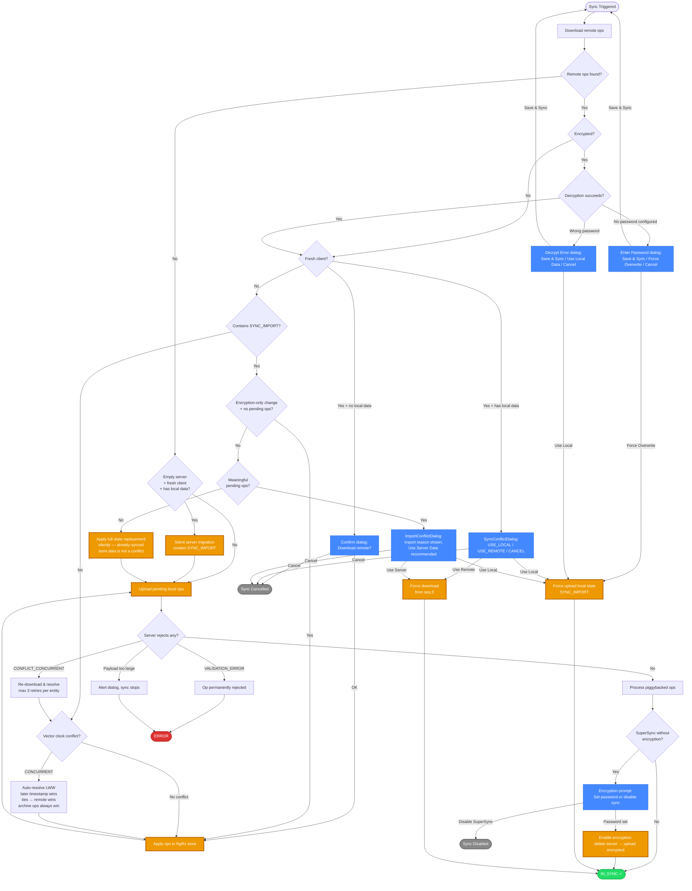

# SuperSync Sync Flow — Mermaid Chart

Visual overview of the main sync decision tree. For full details see [supersync-scenarios.md](./supersync-scenarios.md).

**Legend:**

- 🟢 Green = success states
- 🔴 Red = error states
- 🔵 Blue = user-facing dialogs
- 🟠 Orange = key actions (state changes, uploads, downloads)
- ⚫ Gray = cancelled/disabled

**Notes:**

- The `Enter Password` and `Decrypt Error` dialogs correspond to `DecryptNoPasswordError` and `DecryptError` respectively — they are distinct components with different options.
- `Encryption-only change` bypass: when an incoming SYNC_IMPORT has `syncImportReason === 'PASSWORD_CHANGED'` and there are no meaningful pending ops, the dialog is skipped (data is identical, only encryption changed).
- `IMPORT_CONFLICT` gate uses pending ops only, not store contents (`_hasMeaningfulPendingOps()`). "Meaningful" = TASK/PROJECT/TAG/NOTE create/update/delete or full-state ops — config-only ops don't count. Already-synced store data is not a conflict with the incoming SYNC_IMPORT — the user-facing warning happens on the originating device. Including store contents in the gate would let an old client pick `USE_LOCAL` and force-upload its stale pre-import state, rolling back the remote import for everyone.
- LWW tie-breaking: on equal timestamps, remote wins (server-authoritative). `moveToArchive` operations always win regardless of timestamp.
- Re-download retry limit: max 3 resolution attempts per entity (`MAX_CONCURRENT_RESOLUTION_ATTEMPTS`); if exceeded, ops are permanently rejected.
